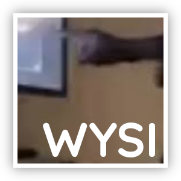

# WYSI



Brainfuck dialect

This repository contains the language itself as well as the bf2wysi converter

## Wordlist

| BF | WYSI   |
|----|--------|
| >  | when   |
| <  | you    |
| +  | almost |
| -  | see    |
| .  | it     |
| ,  | shige  |
| [  | 727    |
| ]  | wysi   |

## Building

```
./build.sh
```

## Notes

### Comments

Comments are broken. But if you really want to comment your "code", escape each word like this:

```
\this \is \a \test\ com \ment
```

Not only that, but no word can be longer than 6 symbols. Yeah, I'm really good at programming. (Actually this is really easy to change and I will do it in future)

### Credits

"Hello world!"s are stolen from [Wikipedia](https://ru.wikipedia.org/wiki/Brainfuck)
